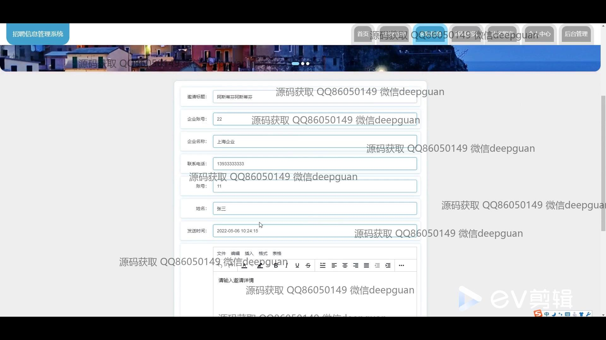

<h1 align="center">招聘信息管理系统</h1>

## 简介
招聘信息管理系统：用户分为企业和个人；支持职位发布、简历管理、用户注册与登录、信息编辑、社区留言、以及后台管理等功能模块，界面简洁易用。    --计算机毕业设计源码；毕设源码；java毕业设计源码

## 联系方式

<h3 align="center">获取完整代码与数据库文件 + 微信：deepguan QQ: 86050149 QQ群: 783742310</h3>

<h3 align="center">可帮忙远程部署 包运行成功！提供远程部署、修改代码、设计文档指导、代码讲解等服务！</h3>

## 功能介绍（完整见运行截图）
管理员：基本功能包括登录、注册和退出。管理界面提供了用户管理、企业管理、工作类型管理、企业招聘管理、投递信息管理、面试邀请管理、求职信息管理、社区留言和系统管理等功能模块。管理员可以上传和编辑信息，管理网站内容，查看和处理用户提交的信息，确保系统的正常运行和数据的有效管理。

企业用户：企业用户可以注册和登录账号，通过个人中心查看和修改企业信息。功能模块包括企业招聘管理和投递信息管理，支持职位发布、简历查看和面试邀请的发送。企业用户可以依据企业需求进行职位详情编辑，管理招聘过程，实现高效的人才筛选和招聘。

普通用户：普通用户可以通过注册和登录访问系统，填写和管理个人信息，通过个人中心查看和更新个人资料。系统提供求职信息的输入界面，用户可上传简历并投递至对应岗位；还支持求职详情查看和信息更新。用户可以收藏职位，了解企业招聘信息和新闻资讯。

访客：访客可以通过网站首页访问公开信息。主要功能包括查看企业招聘信息、浏览新闻资讯和参与社区留言。网站首页提供导航栏和搜索栏，方便访客快速定位感兴趣的内容，帮助提高招聘信息的曝光率和互动。

## 运行截图

本代码来源于网络,仅供学习参考使用!

